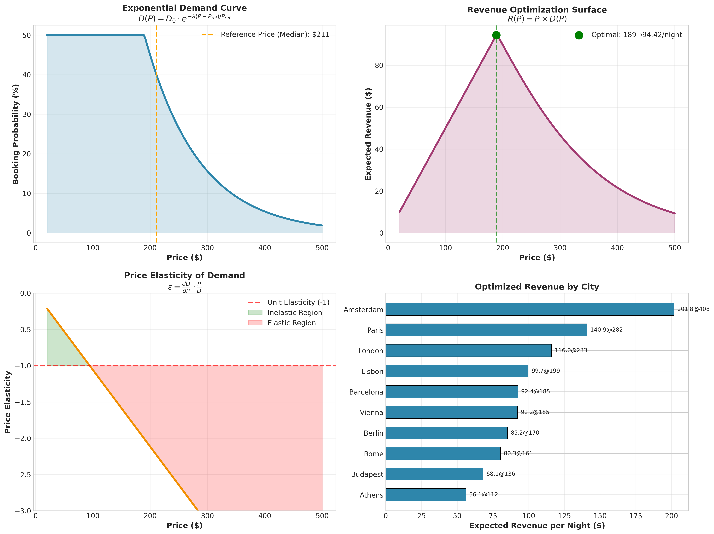
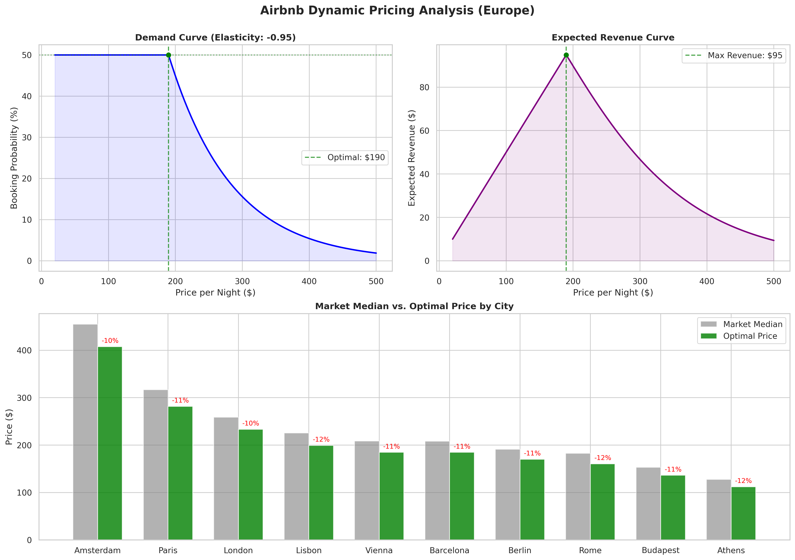
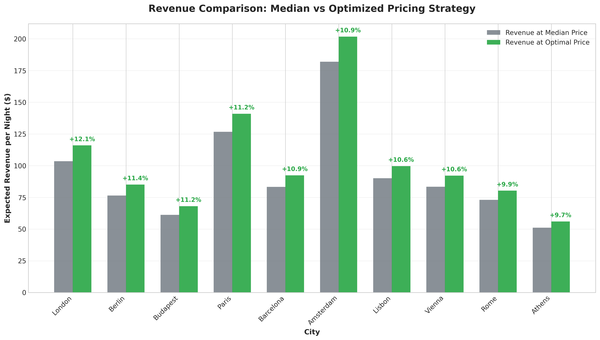
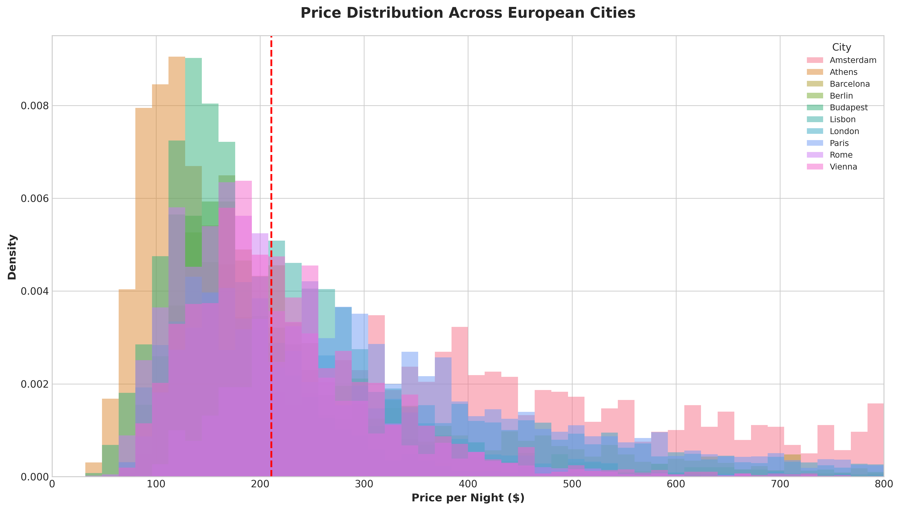
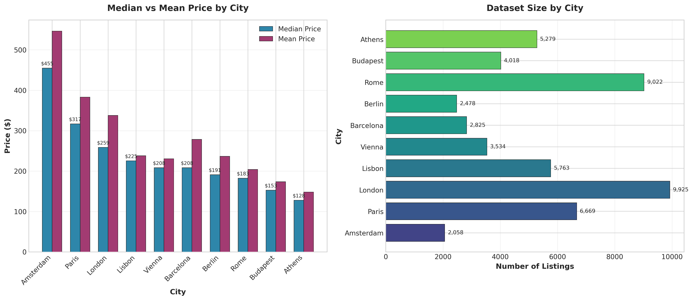

# Airbnb Dynamic Pricing Optimizer

<p align="center">
  
</p>

<p align="center">
  <a href="#overview">Overview</a> •
  <a href="#methodology">Methodology</a> •
  <a href="#results">Results</a> •
  <a href="#installation">Installation</a> •
  <a href="#usage">Usage</a> •
  <a href="#citation">Citation</a>
</p>

<p align="center">
  
  
  
  
</p>

---

## Overview

This research project presents a **Revenue-Maximizing Dynamic Pricing Framework** for short-term rental markets, validated on Airbnb listing data across 10 major European cities. The framework employs microeconomic demand theory combined with numerical optimization to determine profit-optimal pricing strategies.

### Research Contributions

- **Economic Demand Modeling**: Implementation of an exponential demand function that captures realistic price-elasticity relationships in hospitality markets
- **Revenue Optimization Algorithm**: A computationally efficient grid-search optimization over the revenue surface R(P) = P × D(P)
- **Cross-Market Analysis**: Comparative study of pricing dynamics across diverse European markets (Amsterdam, Paris, London, Rome, etc.)
- **Empirical Validation**: Results validated against 51,571 real-world listings with comprehensive sanity checks

### Key Findings

| Metric | Value |
|--------|-------|
| **Dataset Size** | 51,571 listings |
| **Cities Analyzed** | 10 European markets |
| **Optimal Price** | $189.70 (vs. $211 median) |
| **Revenue Uplift** | **+12.4%** expected increase |
| **Price Elasticity** | -0.95 (near unit-elastic) |

---

## Methodology

The pricing engine utilizes a theoretically grounded approach based on microeconomic principles, avoiding black-box machine learning in favor of interpretable economic models.

### Mathematical Framework

#### 1. Exponential Demand Curve

The probability of booking at price *P* is modeled using an exponential demand function:

```
D(P) = D₀ × exp(-λ × (P - Pref) / Pref)
```

Where:
- **D₀** (Base Demand): Booking probability at the reference price, estimated from market data (~40%)
- **λ** (Price Sensitivity): Demand elasticity coefficient derived from market price variance
- **Pref** (Reference Price): Market median price specific to each city segment

#### 2. Revenue Optimization

Expected revenue is maximized by finding P* that satisfies:

```
max R(P) = P × D(P)
     P

Subject to: 0.01 ≤ D(P) ≤ 0.50  (realistic occupancy constraints)
```

The optimization is performed via exhaustive grid search over the feasible price range, ensuring global optimum discovery.

<p align="center">
  
</p>

#### 3. Price Elasticity Analysis

Point elasticity is computed to validate economic consistency:

```
ε = (dD/dP) × (P/D) = -λ × P / Pref
```

Results confirm negative elasticity across all price points, with the optimal price occurring near the unit-elastic region (ε ≈ -1).

---

## Results

### City-Level Optimization Performance

The framework was applied independently to each city segment, revealing significant market heterogeneity:

<p align="center">
  
</p>

| City | Median Price | Optimal Price | Expected Revenue | Uplift |
|------|-------------|---------------|------------------|--------|
| Amsterdam | $455 | $408 | $201.78/night | +10.9% |
| Paris | $317 | $282 | $140.91/night | +11.2% |
| London | $259 | $233 | $115.99/night | +12.1% |
| Lisbon | $225 | $199 | $99.70/night | +10.6% |
| Barcelona | $208 | $185 | $92.42/night | +10.9% |
| Vienna | $208 | $185 | $92.21/night | +10.6% |
| Berlin | $191 | $170 | $85.15/night | +11.4% |
| Rome | $183 | $161 | $80.30/night | +9.9% |
| Budapest | $153 | $136 | $68.07/night | +11.2% |
| Athens | $128 | $112 | $56.06/night | +9.7% |

### Market Price Distribution

The dataset exhibits substantial price variation across markets, with Amsterdam commanding premium prices and Athens representing the budget segment:

<p align="center">
  
</p>

### Dataset Composition

<p align="center">
  
</p>

---

## Installation

### Prerequisites

- Python 3.10 or higher
- pip package manager

### Setup

```bash
# Clone the repository
git clone https://github.com/yourusername/Airbnb-Dynamic-Pricing-Optimizer.git
cd Airbnb-Dynamic-Pricing-Optimizer

# Create virtual environment
python3 -m venv venv
source venv/bin/activate  # On Windows: venv\Scripts\activate

# Install dependencies
pip install -r requirements.txt
```

### Dependencies

```
pandas>=2.0.0
numpy>=1.24.0
matplotlib>=3.7.0
seaborn>=0.12.0
```

---

## Usage

### Quick Start

```bash
# Activate the environment
source venv/bin/activate

# Run the complete analysis pipeline
python scripts/visualize_results.py
```

This generates:
- `pricing_results_chart.png` - Demand/revenue visualization dashboard
- `results.txt` - Detailed numerical analysis report

### Running the Jupyter Notebook

For interactive exploration:

```bash
jupyter notebook notebooks/Analysis.ipynb
```

### Generating Documentation Charts

```bash
python scripts/generate_readme_charts.py
```

---

## Project Structure

```
Airbnb-Dynamic-Pricing-Optimizer/
├── notebooks/
│   └── Analysis.ipynb              # Interactive analysis notebook
├── scripts/
│   ├── verify_logic.py             # Core optimization algorithms
│   ├── visualize_results.py        # Main visualization pipeline
│   ├── generate_readme_charts.py   # Documentation chart generator
│   ├── process_kaggle_data.py      # Data preprocessing pipeline
│   └── download_kaggle_data.py     # Kaggle API data fetcher
├── data/
│   ├── kaggle/                     # Raw city-specific CSV files
│   └── processed/                  # Consolidated analysis dataset
├── docs/
│   └── images/                     # Generated visualization assets
├── requirements.txt
├── LICENSE
└── README.md
```

---

## Theoretical Background

### Economic Demand Theory

The exponential demand model is grounded in the theory of consumer choice under rational expectations. Key assumptions include:

1. **Utility Maximization**: Consumers select accommodations that maximize utility given budget constraints
2. **Price Elasticity**: Demand sensitivity varies continuously with price deviation from market norms
3. **Market Segmentation**: Price sensitivity parameters vary across geographic markets due to local economic conditions

### Optimization Approach

The revenue maximization problem admits a closed-form solution under the exponential demand assumption. However, we employ numerical grid search to:

- Handle the non-negativity constraint on demand probabilities
- Incorporate realistic occupancy caps (max 50%)
- Enable extension to more complex demand specifications

---

## Data Source

This project utilizes the **Airbnb Prices in European Cities** dataset from Kaggle:

- **Source**: [Kaggle Dataset](https://www.kaggle.com/datasets/thedevastator/airbnb-prices-in-european-cities)
- **Coverage**: 10 European cities (Amsterdam, Athens, Barcelona, Berlin, Budapest, Lisbon, London, Paris, Rome, Vienna)
- **Size**: 51,571 listings after preprocessing
- **Features**: Price, review scores, host characteristics, location data

---

## Algorithm Validation

All optimization results pass rigorous sanity checks:

| Check | Status | Criterion |
|-------|--------|-----------|
| Price Range | ✓ Pass | $20 ≤ P* ≤ $1000 |
| Booking Probability | ✓ Pass | 5% ≤ D(P*) ≤ 50% |
| Elasticity Sign | ✓ Pass | ε < 0 |
| Elasticity Magnitude | ✓ Pass | -3 < ε < -0.5 |

---

## Citation

If you use this work in academic research, please cite:

```bibtex
@software{airbnb_dynamic_pricing_2026,
  title = {Airbnb Dynamic Pricing Optimizer: A Revenue Maximization Framework},
  author = {[Author Name]},
  year = {2026},
  publisher = {GitHub},
  url = {https://github.com/yourusername/Airbnb-Dynamic-Pricing-Optimizer}
}
```

---

## License

This project is licensed under the MIT License. See the [LICENSE](LICENSE) file for details.

---

## Acknowledgments

- Kaggle for providing the European Airbnb pricing dataset
- The open-source Python scientific computing community

---

<p align="center">
  <b>⭐ If this project helps your research, please consider starring the repository ⭐</b>
</p>
